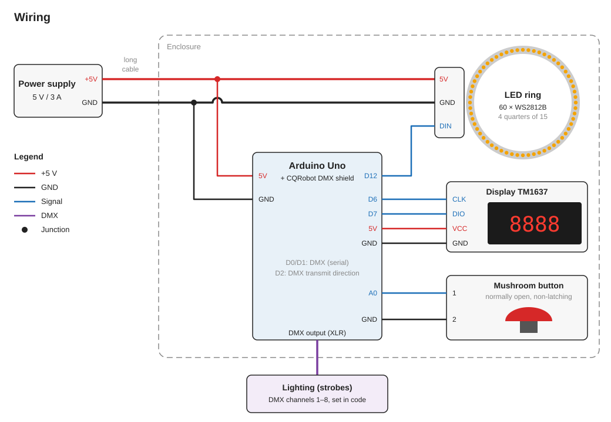

# dmx-led-btn-timer-display-countdown

[Deutsche Version](README.md)

A mushroom button triggers lighting equipment (e.g. strobes) via DMX. After the button is pressed, a 5-second countdown runs, then the lighting is switched on for 3 seconds. After that, the button is locked for a cooldown period. An LED ring and a 4-digit display show which state the device is in.

## Sequence

| State | Duration | Display | LED ring | DMX |
| --- | --- | --- | --- | --- |
| Start (after power-on) | 3 s | `load` | white dot circles around | **on** |
| Ready | until the button is pressed | `push` | coloured dot circles around, with random glitter | off |
| Countdown | 5 s | time left `00:05` … `00:01` | whole ring flashes white once per second | off |
| Flash | 3 s | time left `00:03` … `00:01` | off | **on** |
| Cooldown | 1 min | time left `01:00` … `00:01` | dim red bar that keeps getting shorter | off |

The time left is shown as minutes (first two digits) and seconds (last two digits). After the cooldown, the device is ready again.

Pressing the button outside "Ready" does not start anything. The display shows `wait` for 0.5 s, and the ring glows dim red.

## Components

| Component | Details |
| --- | --- |
| Microcontroller | Arduino Uno |
| DMX shield | CQRobot DMX (RDM) Shield for Arduino (DMX512), plugged onto the Uno |
| LED ring | 60 × WS2812B, made of four quarter-circle segments with 15 LEDs each |
| Display | 4-digit 7-segment display with TM1637 driver |
| Button | Mushroom button, normally open (NO), momentary (does not latch), debounced |
| Power supply | 5 V, 3 A |

## Wiring



| Arduino pin | Connected to | Note |
| --- | --- | --- |
| D12 | LED ring, data input (DIN) | |
| D6 | Display CLK | |
| D7 | Display DIO | |
| A0 | Mushroom button | The other side of the button is connected to GND. A0 uses the internal pull-up resistor. |
| D0, D1 | DMX shield | Serial port, used by the shield |
| D2 | DMX shield | Transmit direction, used by the shield |
| 5V, GND | Power supply, display | The Arduino is powered through the 5V pin. |

About the button: the button is a normally open (NO) contact between A0 and GND. While it is pressed, A0 is LOW. The code counts the change from LOW to HIGH as a press, so the countdown starts when the button is released. If you replace the button, use a normally open contact again.

## Power supply

The 5 V power supply feeds the LED ring directly. The Arduino is connected to the same power supply through its 5V pin.

**Important:** The cable between the power supply and the device is long. If the LEDs draw too much current, the voltage drops. The Arduino then crashes and does not start again. That is why the code limits the LED current:

```cpp
FastLED.setMaxPowerInVoltsAndMilliamps(5, 1000); // 5 V, max. 1000 mA
```

If the power supply is further away or the cable is thinner, this value must be lowered. The LEDs will then be dimmer. If the power supply is closer, the value can be raised. The power supply delivers 3 A in total and also powers the Arduino, the shield and the display.

## DMX

The DMX shield uses the Arduino's serial port (D0/D1) and pin D2 for the transmit direction.

### Jumpers on the shield

| Jumper | Position |
| --- | --- |
| EN / EN̅ | **EN** during operation, **EN̅** for uploading (see below) |
| Slave / DE | DE |
| TX-io / TX-uart | TX-uart |
| RX-io / RX-uart | RX-uart |

The code needs these positions: it sends via the hardware serial port (UART) and controls the transmit direction via D2.

### Channels and values

The code sends on DMX channels 1 to 8:

| Channel | 1 | 2 | 3 | 4 | 5 | 6 | 7 | 8 |
| --- | --- | --- | --- | --- | --- | --- | --- | --- |
| on (`dmx_high()`) | 255 | 95 | 255 | 255 | 255 | 120 | 255 | 0 |
| off (`dmx_low()`) | 0 | 0 | 0 | 0 | 0 | 0 | 0 | 0 |

This project does not define which devices are connected or how their channels are assigned. For other devices, adjust the channels and values in the functions `dmx_high()` (start and flash) and `dmx_low()` (all other states).

## Software

### Libraries

Install the libraries in the Arduino IDE using the Library Manager. Board: **Arduino Uno** (package "Arduino AVR Boards").

| Library | Version | Source |
| --- | --- | --- |
| DMXSerial | 1.5.3 | <https://github.com/mathertel/DMXSerial> |
| FastLED | **3.10.3** | <https://github.com/FastLED/FastLED> |
| TM1637TinyDisplay | 1.12.2 | <https://github.com/jasonacox/TM1637TinyDisplay> |

The sketch compiles with these versions (checked on 2026-10-04 with "Arduino AVR Boards" 1.8.8). Which versions were used when the code was originally uploaded is not known.

**Note:** From FastLED 3.10.4 on, compiling fails with the error `'FASTLED_USING_NAMESPACE' does not name a type`. Select version 3.10.3 in the Library Manager, or change the code to use the latest version.

### Uploading

The shield and the USB port share the serial port, so uploading does not work while the shield is active.

1. Set the jumper **EN / EN̅** to **EN̅** (or unplug the shield).
2. Open `sisy_btn/sisy_btn.ino` in the Arduino IDE.
3. Select the board "Arduino Uno" and the correct port, then upload.
4. Set the jumper back to **EN**. Otherwise no DMX is sent.

For the same reason, the Serial Monitor cannot be used for debugging.

### Settings in the code

| Setting | Location in the code | Current value |
| --- | --- | --- |
| LED current limit | `setup()`: `FastLED.setMaxPowerInVoltsAndMilliamps(5, 1000)` | 1000 mA |
| Start duration | `setup()`: `state_for = 3000` | 3 s |
| Countdown duration | `nextStateControll()`, `case 1`: `state_for = 5UL * 1000UL` | 5 s |
| Flash duration | `nextStateControll()`, `case 2`: `state_for = 3UL * 1000UL` | 3 s |
| Cooldown duration | `nextStateControll()`, `case 3`: `state_for = 1UL * 60UL * 1000UL` | 1 min |
| Display brightness | `displayBrightness` | 2 (range 0–7) |
| DMX channels and values | `dmx_high()`, `dmx_low()` | see [DMX](#dmx) |
| Pins | `DATA_PIN`, `CLK`, `DIO`, `btn_pin` | 12, 6, 7, A0 |

All times in the code are in milliseconds.
