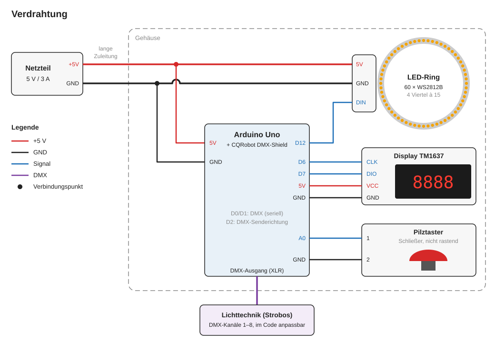

# dmx-led-btn-timer-display-countdown

[English version](README.en.md)

Ein Pilztaster löst über DMX Lichttechnik aus (z. B. Strobos). Nach dem Drücken läuft ein Countdown von 5 Sekunden, dann wird die Lichttechnik für 3 Sekunden eingeschaltet. Danach ist der Taster für eine Wartezeit gesperrt. Ein LED-Ring und ein 4-stelliges Display zeigen, in welchem Zustand das Gerät gerade ist.

## Ablauf

| Zustand | Dauer | Display | LED-Ring | DMX |
| --- | --- | --- | --- | --- |
| Start (nach dem Einschalten) | 3 s | `load` | weißer Lichtpunkt kreist | **an** |
| Bereit | bis zum Tastendruck | `push` | farbiger Lichtpunkt kreist, dazu zufälliges Glitzern | aus |
| Countdown | 5 s | Restzeit `00:05` … `00:01` | ganzer Ring blitzt einmal pro Sekunde weiß | aus |
| Auslösen | 3 s | Restzeit `00:03` … `00:01` | aus | **an** |
| Wartezeit | 1 min | Restzeit `01:00` … `00:01` | schwach roter Balken, der immer kürzer wird | aus |

Die Restzeit erscheint als Minuten (erste zwei Ziffern) und Sekunden (letzte zwei Ziffern). Nach der Wartezeit ist das Gerät wieder bereit.

Ein Tastendruck außerhalb von „Bereit“ startet nichts. Das Display zeigt dann 0,5 s lang `wait`, und der Ring leuchtet schwach rot.

## Bauteile

| Bauteil | Details |
| --- | --- |
| Mikrocontroller | Arduino Uno |
| DMX-Shield | CQRobot DMX (RDM) Shield für Arduino (DMX512), auf den Uno gesteckt |
| LED-Ring | 60 × WS2812B, aus vier Viertelkreisen à 15 LEDs |
| Display | 4-stellige 7-Segment-Anzeige mit TM1637-Treiber |
| Taster | Pilztaster, Schließer, tastend (rastet nicht ein), entprellt |
| Netzteil | 5 V, 3 A |

## Verdrahtung



| Arduino-Pin | Verbunden mit | Hinweis |
| --- | --- | --- |
| D12 | LED-Ring, Dateneingang (DIN) | |
| D6 | Display CLK | |
| D7 | Display DIO | |
| A0 | Pilztaster | Die andere Seite des Tasters liegt an GND. A0 nutzt den internen Pull-up-Widerstand. |
| D0, D1 | DMX-Shield | Serielle Schnittstelle, vom Shield belegt |
| D2 | DMX-Shield | Senderichtung, vom Shield belegt |
| 5V, GND | Netzteil, Display | Der Arduino wird über den 5V-Pin versorgt. |

Zum Taster: Der Taster ist ein Schließer zwischen A0 und GND. Solange er gedrückt ist, liegt A0 auf LOW. Der Code wertet den Wechsel von LOW auf HIGH als Tastendruck, der Countdown startet also beim Loslassen. Wer den Taster tauscht, muss wieder einen Schließer verwenden.

## Stromversorgung

Das 5-V-Netzteil versorgt den LED-Ring direkt. Der Arduino hängt über seinen 5V-Pin am selben Netzteil.

**Wichtig:** Die Leitung zwischen Netzteil und Gerät ist lang. Ziehen die LEDs zu viel Strom, bricht die Spannung ein. Der Arduino stürzt dann ab und startet nicht wieder. Deshalb begrenzt der Code den Strom der LEDs:

```cpp
FastLED.setMaxPowerInVoltsAndMilliamps(5, 1000); // 5 V, max. 1000 mA
```

Ist das Netzteil weiter weg oder die Leitung dünner, muss dieser Wert kleiner werden. Die LEDs leuchten dann dunkler. Ist das Netzteil näher dran, kann der Wert größer werden. Das Netzteil liefert insgesamt 3 A und versorgt auch Arduino, Shield und Display.

## DMX

Das DMX-Shield nutzt die serielle Schnittstelle des Arduino (D0/D1) und Pin D2 für die Senderichtung.

### Jumper auf dem Shield

| Jumper | Stellung |
| --- | --- |
| EN / EN̅ | **EN** im Betrieb, **EN̅** zum Hochladen (siehe unten) |
| Slave / DE | DE |
| TX-io / TX-uart | TX-uart |
| RX-io / RX-uart | RX-uart |

Diese Stellungen braucht der Code: Er sendet über die Hardware-Schnittstelle (UART) und steuert die Senderichtung über D2.

### Kanäle und Werte

Der Code sendet auf den DMX-Kanälen 1 bis 8:

| Kanal | 1 | 2 | 3 | 4 | 5 | 6 | 7 | 8 |
| --- | --- | --- | --- | --- | --- | --- | --- | --- |
| an (`dmx_high()`) | 255 | 95 | 255 | 255 | 255 | 120 | 255 | 0 |
| aus (`dmx_low()`) | 0 | 0 | 0 | 0 | 0 | 0 | 0 | 0 |

Welche Geräte angeschlossen werden und wie deren Kanäle belegt sind, legt dieses Projekt nicht fest. Für andere Geräte passt man Kanäle und Werte in den Funktionen `dmx_high()` (Start und Auslösen) und `dmx_low()` (alle anderen Zustände) an.

## Software

### Bibliotheken

Die Bibliotheken werden in der Arduino IDE über den Bibliotheksverwalter installiert. Board: **Arduino Uno** (Paket „Arduino AVR Boards“).

| Bibliothek | Version | Quelle |
| --- | --- | --- |
| DMXSerial | 1.5.3 | <https://github.com/mathertel/DMXSerial> |
| FastLED | **3.10.3** | <https://github.com/FastLED/FastLED> |
| TM1637TinyDisplay | 1.12.2 | <https://github.com/jasonacox/TM1637TinyDisplay> |

Mit diesen Versionen kompiliert der Sketch (geprüft am 04.10.2026 mit „Arduino AVR Boards“ 1.8.8). Mit welchen Versionen der Code ursprünglich aufgespielt wurde, ist nicht bekannt.

**Achtung:** Ab FastLED 3.10.4 bricht das Kompilieren mit dem Fehler `'FASTLED_USING_NAMESPACE' does not name a type` ab. Im Bibliotheksverwalter deshalb Version 3.10.3 auswählen bzw. im Code umbauen, um die aktuellste Version zu nutzen.

### Hochladen

Das Shield und der USB-Anschluss teilen sich die serielle Schnittstelle. Bei aktivem Shield klappt das Hochladen deshalb nicht.

1. Jumper **EN / EN̅** auf **EN̅** stellen (oder das Shield abziehen).
2. `sisy_btn/sisy_btn.ino` in der Arduino IDE öffnen.
3. Board „Arduino Uno“ und den richtigen Port auswählen, dann hochladen.
4. Jumper wieder auf **EN** stellen. Sonst wird kein DMX gesendet.

Aus demselben Grund lässt sich der serielle Monitor nicht zur Fehlersuche nutzen.

### Einstellungen im Code

| Einstellung | Stelle im Code | Aktueller Wert |
| --- | --- | --- |
| Strombegrenzung LEDs | `setup()`: `FastLED.setMaxPowerInVoltsAndMilliamps(5, 1000)` | 1000 mA |
| Dauer Start | `setup()`: `state_for = 3000` | 3 s |
| Dauer Countdown | `nextStateControll()`, `case 1`: `state_for = 5UL * 1000UL` | 5 s |
| Dauer Auslösen | `nextStateControll()`, `case 2`: `state_for = 3UL * 1000UL` | 3 s |
| Dauer Wartezeit | `nextStateControll()`, `case 3`: `state_for = 1UL * 60UL * 1000UL` | 1 min |
| Helligkeit Display | `displayBrightness` | 2 (Bereich 0–7) |
| DMX-Kanäle und -Werte | `dmx_high()`, `dmx_low()` | siehe [DMX](#dmx) |
| Pins | `DATA_PIN`, `CLK`, `DIO`, `btn_pin` | 12, 6, 7, A0 |

Alle Zeiten stehen im Code in Millisekunden.
